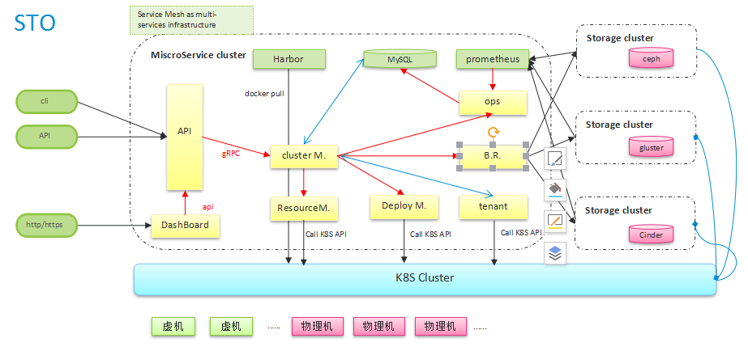

# STO

This project shows a solution for storage management between Kubernetes and Storage products.

Welcome everybody to contributing this project.

# Architecture(draft)

The architecure is been discussing and modifying. When it's ready, we will release it.

# preface

CSI（Container Storage Interface）从kubernetes 1.9版本开始引入，用于在容器和共享存储之间建立一套标准的存储访问接口。

Kubernetes提供一些Sidecar（辅助）容器。

1. External-attacher

监听VolumeAttachment对象并触发ControllerPublish和ControllerUnPublish操作的容器。

1. External-provisioner

监听PVC对象并触发对CSI Endpoint的CreateVolume和DeleteVolume操作。

1. Driver-register

使用Kubelet注册CSI驱动程序的容器，并将NodeId添加到Node的annotation中。

动态存储

集群管理员无需手动创建PV，而是通过对storageclass的设置，对后端存储进行描述。此时PVC也需要对存储类型进行声明。如果PVC的class设置为空，则PVC被精致实用动态创建PV。

静态存储

集群管理员手动创建PV，同时创建后端存储的特性。

# Our vision:

1. Automatic storage cluster deployment.
   a. single kind, single storage cluster
   b. single kinds, multiple storage clusters 
   c. multiple kinds, multiple storage clusters

1. Storage cluster scale up
   a. add one new storage cluster
   b. add new node to existed storage cluster
   c. do not support scale down the storage cluster

1. Data backup and recovery

1. Tenant management
   a. kubernetes namespace
   b. kubernetes RBAC

1. [CSI](http://blog.kubernetes.io/2018/01/introducing-container-storage-interface.html) and FlexVolume
   a. deploy CSI plugin to kubernetes node

1. Tenant resource quota
   a. limit the tenant(namespace) storage quota
   b. limit the volume size

1. Storage metrics
   a. accurate metrics, maybe [prometheus](https://prometheus.io/) 

1. Parameter template
   according to user's demands, serve some optional or recommanded parameter templates of storage cluster.

1. Storage images
   make many kinds of storage docker images.
